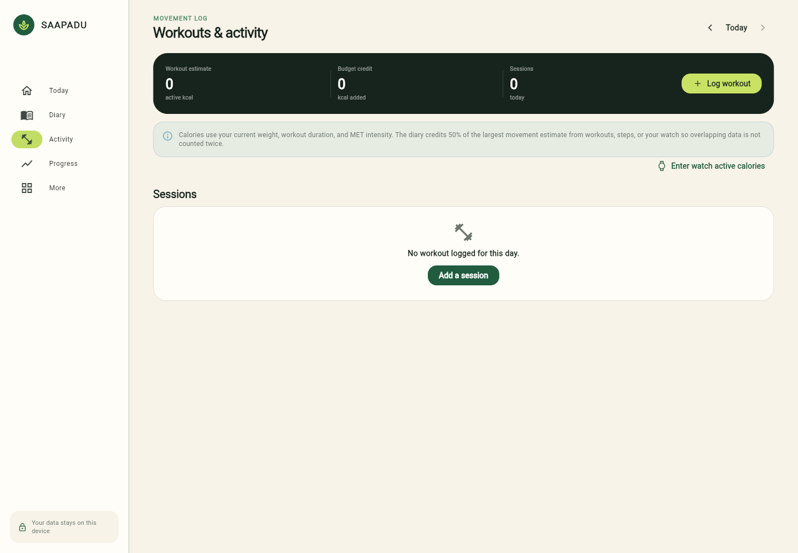
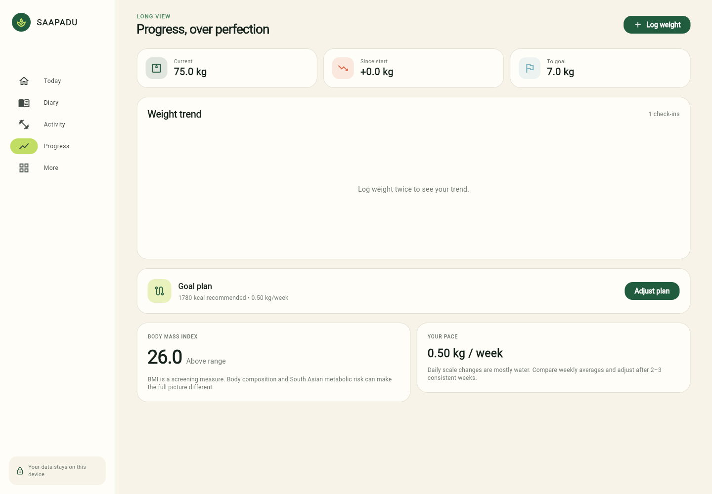
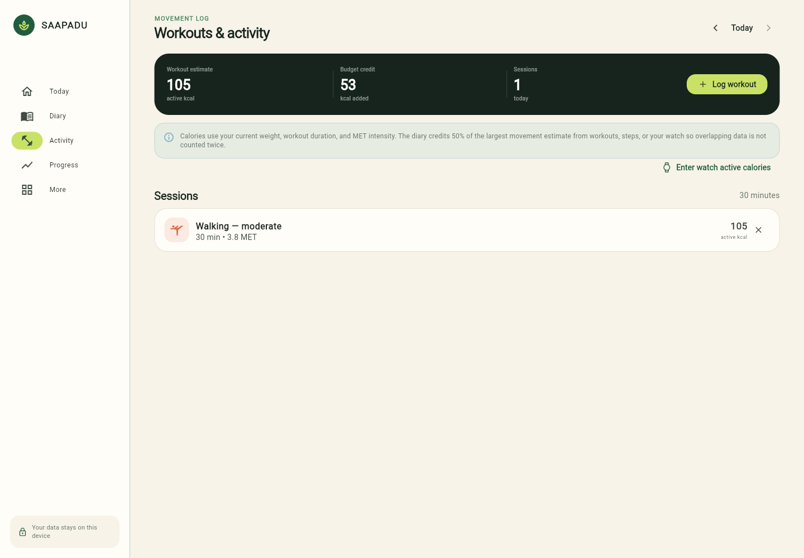

<div align="center">

# Saapadu

### A calm, South Indian first calorie and wellness tracker

Track meals, macros, movement, sleep, fasting, and weight over the weeks that actually matter.

[](https://saapadu-tracker.vercel.app)
[](https://flutter.dev)
[](#)

</div>

<p align="center">
  
  
  
</p>

Saapadu is a personal tracker built around familiar Indian portions instead of generic food databases. It keeps the daily experience simple, while connecting the numbers behind it: a weigh-in changes the current calorie recommendation, a custom target projects a goal date, and logged movement can add a conservative activity credit.

## What it does

- **South Indian food diary** — 141 built-in foods, searchable aliases, practical serving sizes, and custom foods.
- **Complete nutrition view** — calories, protein, carbohydrates, fat, and fiber for every logged meal.
- **Dynamic goal planning** — recommended targets, custom targets, weekly pace, selected goal dates, and a projected completion date derived from the active target.
- **Weight feedback loop** — weekly check-ins update the current plan and today’s target while preserving historical diary snapshots.
- **Activity tracking** — walking, running, cycling, strength training, yoga, cricket, badminton, swimming, HIIT, and more with MET-based estimates.
- **Daily wellness** — water, sleep, steps, manual watch calories, notes, and intermittent fasting.
- **Useful suggestions** — protein and fiber gap prompts plus practical next-meal ideas based on what is still missing.
- **Reliable storage** — automatic local persistence, offline web caching, JSON backup/restore, and optional Google/Supabase sync across devices.

## Try it

Open the hosted version at **[saapadu-tracker.vercel.app](https://saapadu-tracker.vercel.app)**. The web build works on phones and desktops and can be installed from a compatible browser as a progressive web app.

For Android, build the personal APK from the project or use the release artifact generated by Flutter:

```bash
flutter build apk --release
```

## Run locally

```bash
flutter pub get
flutter test
flutter analyze
flutter run -d chrome
```

Build production artifacts with:

```bash
flutter build web --release
flutter build apk --release
```

## Optional cloud history

The app is useful without an account. To retain the diary across browsers and devices, create a Supabase project, run the SQL migration, enable Google OAuth, and build with the public project values:

```bash
flutter build web --release \
  --dart-define=SUPABASE_URL=https://PROJECT_REF.supabase.co \
  --dart-define=SUPABASE_PUBLISHABLE_KEY=YOUR_PUBLISHABLE_KEY \
  --dart-define=ALLOWED_EMAIL=YOUR_GOOGLE_EMAIL
```

See [`docs/cloud_setup.md`](docs/cloud_setup.md) and [`supabase/migrations/202609170001_cloud_backup.sql`](supabase/migrations/202609170001_cloud_backup.sql). Never place a Supabase secret or `service_role` key in a client build.

## How the numbers are handled

The target uses a Mifflin–St Jeor estimate, an activity factor, goal direction, and conservative safety floors. Workout estimates use MET values and credit 50% of the largest overlapping movement estimate so steps, workouts, and watch totals are not blindly added together.

The formulas, guardrails, nutrition sources, and workout assumptions are documented here:

- [`docs/health_calculations.md`](docs/health_calculations.md)
- [`docs/nutrition_sources.md`](docs/nutrition_sources.md)
- [`docs/workout_calculations.md`](docs/workout_calculations.md)

## Project shape

```text
lib/                 Flutter UI, state, models, and calculation engines
assets/data/         South Indian food catalog
supabase/migrations/ Optional cloud backup schema and row-level policies
docs/                Calculation notes, sources, and setup guides
test/                Calculation and workout coverage
web/                 PWA metadata, offline service worker, and Vercel headers
```

Saapadu has no ads or analytics. Keep an occasional backup from **More → Data & backup** before clearing browser data or moving devices.
